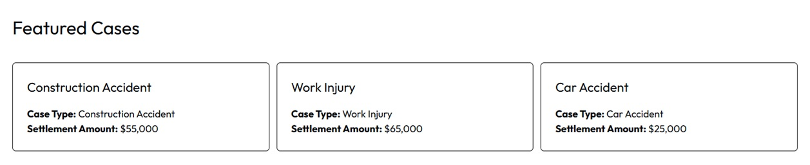
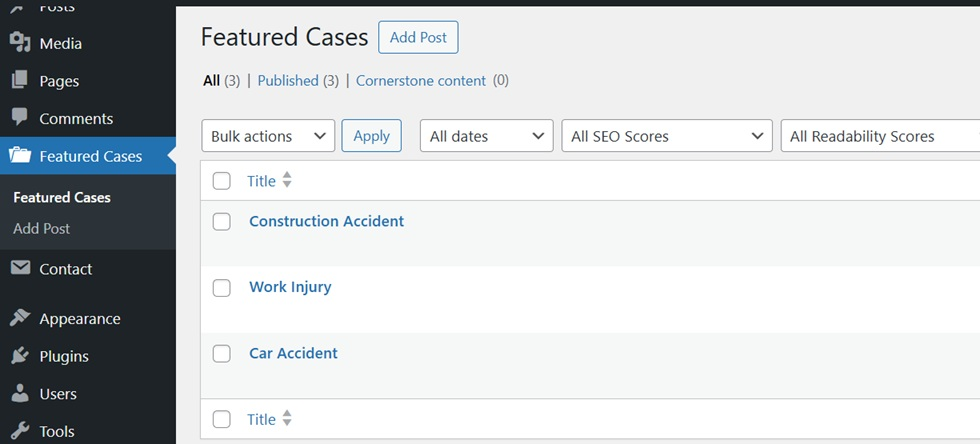

## Custom Post Type: Featured Cases

This project includes a custom post type called **Featured Cases**, used
to manage and display highlighted case entries within the blog.


___

### Archive Template Setup

To display the Featured Cases archive, add the file `archive-featured_case` to your theme, available at `/files/archive-featured_case.php`

Copy this file into the root of your active theme (or child theme).  
WordPress will automatically use this template to render the archive page for the **Featured Cases** custom post type.

___

### Registering the Custom Post Type

Add the following code to the theme's `functions.php` file to register
the **Featured Case** post type:

``` php
function register_featured_case_cpt() {
    register_post_type('featured_case', [
        'labels' => [
            'name'          => 'Featured Cases',
            'singular_name' => 'Featured Case',
        ],
        'public'        => true,
        'has_archive'   => true,
        'menu_icon'     => 'dashicons-portfolio',
        'supports'      => ['title'],
        'show_in_rest'  => true,
    ]);
}
add_action('init', 'register_featured_case_cpt');
```

After adding this code, go to the WordPress Admin panel and navigate to **Featured Cases** in the left sidebar 


___

### Importing Custom Fields (Using ACF Plugin)

This project includes an exported ACF field group containing the custom
fields used by the **Featured Cases** post type, such as:

-   Case Type
-   Settlement Amount

If you still don't have the ACF plugin, follow the link to know how to install in your theme: https://www.advancedcustomfields.com/resources/installation/

#### How to import the ACF fields

1.  Go to **ACF → Tools** in the WordPress Admin
2.  Click on the button **Import JSON**
3.  Select the provided ACF JSON export file, available at `/files/acf-export-2026-02-01.json` 
___

### Creating posts

In the WordPress admin, create at least **3 Featured Case posts** and fill in the custom fields.
___

> **Note:**\
> For the sake of speed and simplicity, minimal CSS was added directly
> to the template.\
> In a production environment, styles would be extracted into a separate
> stylesheet and enqueued properly using `wp_enqueue_style`.